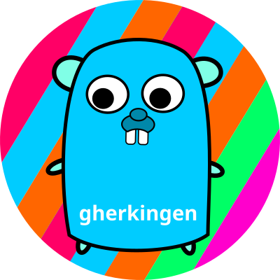

# gherkingen


[](https://goreportcard.com/report/github.com/hedhyw/gherkingen)
[](https://coveralls.io/github/hedhyw/gherkingen?branch=main)
[](https://github.com/avelino/awesome-go)

**It's a Behaviour Driven Development (BDD) tests generator for Golang.**



It accepts a `*.feature` [Cucumber/Gherkin](https://cucumber.io/docs/gherkin/reference/) file and generates a test boilerplate. All that remains is to change the tests a little. The generator supports `go generate` and `go test` for generated tests.

The generator is very customizable, it is possible to customize an output for any golang [testing framework](#frameworks-support) or even for [another language](#language-support).

# What is for?
## Simple example
**Given** [feature](internal/generator/examples/readme.feature) [[reference](https://cucumber.io/docs/gherkin/reference/)]:
```feature
Feature: Application command line tool
  Scenario: User wants to see usage information
    When flag <flag> is provided
    Then usage should be printed <printed>
    And exit status should be <exit_status>
    Examples:
    | <flag>   | <exit_status> | <printed> |
    | --help   |       0       | true      |
    | -help    |       0       | true      |
    | -invalid |       1       | false     |
```

**Then** this generator writes a [golang](internal/generator/examples/readme.feature_test.go) output (`gerkingen readme.feature > readme.feature_test.go`):

```go
func TestApplicationCommandLineTool(t *testing.T) {
	f := bdd.NewFeature(t, "Application command line tool")

	f.Scenario("User wants to see usage information", func(t *testing.T, f *bdd.Feature) {
		type testCase struct {
			Flag       string `field:"<flag>"`
			ExitStatus int    `field:"<exit_status>"`
			Printed    bool   `field:"<printed>"`
		}

		testCases := map[string]testCase{
			"--help_0_true":    {"--help", 0, true},
			"-help_0_true":     {"-help", 0, true},
			"-invalid_1_false": {"-invalid", 1, false},
		}

		f.TestCases(testCases, func(t *testing.T, f *bdd.Feature, tc testCase) {
			f.When("flag <flag> is provided", func() {

			})
			f.Then("usage should be printed <printed>", func() {

			})
			f.And("exit status should be <exit_status>", func() {

			})
		})
	})
}
```

**Then** on failure next logs will be printed:

```feature
Feature: Application command line tool
	Scenario: User wants to see usage information
		# TestCase: {Flag:-invalid ExitStatus:1 Printed:false}
		When flag -invalid is provided
		Then usage should be printed false
		And exit status should be 1
```

**Example** implementation:
```go
f.TestCases(testCases, func(t *testing.T, f *bdd.Feature, tc testCase) {
	var exitStatus int
	arguments := []string{}

	f.When("flag <flag> is provided", func() {
		arguments = append(arguments, tc.Flag)
	})
	f.Then("usage should be printed <printed>", func() {
		var output string
		output, exitStatus = runApp(t, arguments)
		assert.Equal(t, tc.Printed, strings.Contains(output, "usage"))
	})
	f.And("exit status should be <exit_status>", func() {
		assert.Equal(t, tc.ExitStatus, exitStatus)
	})
})
```

## Simplified template

A simplified template is also available. It uses only the std [testing](https://pkg.go.dev/testing) package without any other dependency. Steps are defined by comments.
Provide `-template std.simple.v1.go.tmpl` to to use [this](internal/assets/std.simple.v1.go.tmpl) template.

```go
func TestApplicationCommandLineTool(t *testing.T) {
	t.Parallel()

	t.Run("User wants to see usage information", func(t *testing.T) {
		t.Parallel()

		type testCase struct {
			Flag       string `field:"<flag>"`
			ExitStatus int    `field:"<exit_status>"`
			Printed    bool   `field:"<printed>"`
		}

		testCases := map[string]testCase{
			"--help_0_true":    {"--help", 0, true},
			"-help_0_true":     {"-help", 0, true},
			"-invalid_1_false": {"-invalid", 1, false},
		}

		for name, tc := range testCases {
			t.Run(name, func(t *testing.T) {
				// When flag <flag> is provided

				// Then usage should be printed <printed>

				// And exit status should be <exit_status>

			})
		}
	})
}
```

## More advanced example

See [internal/app/app.feature](internal/app/app.feature) and [internal/app/app_test.go](internal/app/app_test.go).

# Install

## Package

Latest DEB and RPM packages are available on [the releases page](https://github.com/hedhyw/gherkingen/releases/latest).

## MacOS/Linux HomeBrew

```sh
# Install the package using HomeBrew.
brew install hedhyw/gherkingen/gherkingen

# Check that the generator is working.
gherkingen -help
```

## Standalone Binary

Download latest archive `*.tar.gz` for your target platform from [the releases page](https://github.com/hedhyw/gherkingen/releases/latest) and extract it to `/usr/local/bin/gherkingen`. Add this path to `PATH` environment.

Example flow:
```sh
# Check the signature of a downloaded archive and the signature in the file task_checksums.txt from the release page.

# Remove old binaries.
rm -rf /usr/local/gherkingen
# Restore folder structure.
mkdir -p /usr/local/gherkingen
# Extract archive to target path.
tar -C /usr/local/gherkingen -xzf DOWNLOAD_ARCHIVE.TAR.GZ

# Add `/usr/local/gherkingen` to PATH environment variable.
export PATH=/usr/local/gherkingen:$PATH
# Check that the generator is working.
gherkingen -help
```

## Go

```bash
go install github.com/hedhyw/gherkingen/v2/cmd/gherkingen@latest
# Notice: gherkingen -version will return "unknown" version.
```

## Source

```
git clone git@github.com:hedhyw/gherkingen.git
cd gherkingen
make build
cp ./bin/gherkingen /usr/local/bin
chmod +x /usr/local/bin
```

# Usage
## Simple usage

For generating test output, simply run:

```
gherkingen EXAMPLE.feature
```

## More advanced usage

### Generating test output with custom options
```
gherkingen \
    -format go \
    -template my_template.tmpl \
    EXAMPLE.feature
```
### Listing internal templates
```
gherkingen -list
```

### Help
```
gherkingen --help

Usage of gherkingen [FEATURE_FILE]:
  -format string
        output format: autodetect, json, go, raw (default "autodetect")
  -go-parallel
        add parallel mark
  -help
        print usage
  -list
        list internal templates
  -package string
        name of the generated package (default "generated_test")
  -permanent-ids
        The same calls to the generator always produces the same output
  -template string
        template file (default "@/std.struct.v1.go.tmpl")
  -version
        print version
```

## Running in docker

Docker image: https://hub.docker.com/r/hedhyw/gherkingen

Running gherkingen in docker, `<RELATIVE_PATH_TO_FEATURE_FILE>` is
a path to a feature file relatively to the current directory.
```sh
docker run --rm -it --read-only --network none \
	--volume $PWD:/host/:ro \
	hedhyw/gherkingen:latest \
	-- /host/<RELATIVE_PATH_TO_FEATURE_FILE>
```

Passing arguments:
```sh
# Any command-line tool arguments also can be used.
# Example:
docker run --rm -it --read-only --network none \
	hedhyw/gherkingen:latest -list
```

# Output customization

## Custom templates
You can provide your own template, it can be based on [internal/assets/std.struct.v1.go.tmpl](internal/assets/std.struct.v1.go.tmpl). In the command-line tool specify the template
using `-template` flag: `gherkingen -template example.tmpl raw example.feature`

## Frameworks support
It is possible to integrate the generator with any BDD-testing fraemwork. Feel free to
create a pull request for supporting templates for them. For this:
1. Create a template `internal/assets/SOME_NAME.go.tmpl`.
2. Add it to the test `TestOpenTemplate` in the file [internal/assets/assets_test.go](internal/assets/assets_test.go).
3. Check: `make lint check.generate test`.
4. Commit&Push, create a PR.

## Language support

Templates are very customizable, so you can even generate non-golang code. In the command-line tool specify `raw` format using `-format` flag and your template using `-template` flag:
`gherkingen -format raw -template example.tmpl example.feature`.

## Creating templates

Useful resources:
| Resource                                  | Link                                                 |
|-------------------------------------------|------------------------------------------------------|
| Golang template documentation             | [text/template](https://pkg.go.dev/text/template)    |
| Root template object struct documentation | [TemplateData](https://pkg.go.dev/github.com/hedhyw/gherkingen/internal/model#TemplateData) |
| Example template                          | [std.struct.v1.go.tmpl](./internal/assets/std.struct.v1.go.tmpl) |
| Example json representation of a root template object | [readme.feature.json](internal/generator/examples/readme.feature.json)     |

There is a way to return a json representation of the root object `TemplateData` for your feature, for this run `gherkingen -format json <EXAMPLE.feature>`.

Any field of the root object can be used directly, example: `{{ .PackageName }}`.

## golangci-lint `thelper` warning

Exclude the rule `thelper` for scenarios in the configuration **.golangci.yaml**:

```yaml
issues:
  fix: true
  exclude-rules:
    - linters:
        - thelper
      source: "^.*f\\.Scenario.*$"
```

# License

- The library and generator are under [MIT Lecense](LICENSE).
- [The gopher](./assets/gopher.png) is under [Creative Commons Attribution 3.0](https://creativecommons.org/licenses/by/3.0/) license. It was originally designed by [Renée French](https://en.wikipedia.org/wiki/Ren%C3%A9e_French) and redrawed by me.
